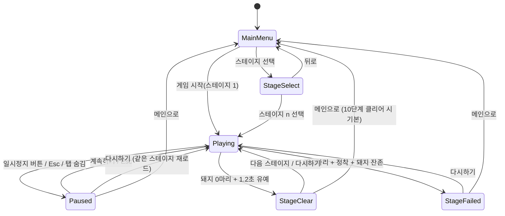

# 웹 브라우저 앵그리버드 게임 — 구현 계획서

- 입력: `plan-smith-lab/model-bump/pure-model/inputs/game-prompt.md`
- 산출 범위: 이 문서는 **계획만** 담는다. 코드는 작성하지 않는다.
- 한 줄 요약: **Vite + TypeScript**, 물리는 **Matter.js**, 렌더링은 **Canvas 2D 자체 렌더러 + DOM 오버레이 UI**, 스테이지는 **정적 TS 데이터 10개**, 클리어 가능성은 **헤드리스 "정답 샷" 테스트**로 보증한다.

---

## 1. 목표·범위·가정

### 1.1 요구사항을 검증 가능한 문장으로 변환

| ID | 원문 | 검증 가능한 형태 |
|----|------|------------------|
| R1 | stage는 10단계 | 서로 다른 레이아웃의 스테이지 1~10이 존재하고, 각각 선택·플레이·클리어 가능하다. 모든 스테이지는 자동 테스트로 "클리어 가능"이 증명된다. |
| R2 | 게임시작 → 앵그리버드와 같은 게임 시스템 | 메인 화면의 [게임 시작] 클릭 후 (a) 새총 위 새를 드래그해 당기고 놓으면 발사되고, (b) 중력에 의한 포물선 비행, (c) 구조물과의 강체 충돌·전복·파괴, (d) 돼지 제거, (e) 점수 집계, (f) 전부 제거 시 클리어 / 새 소진 시 실패가 동작한다. |
| R3 | 일시정지 버튼이 인게임 우측에 있고, 클릭 시 다시하기 / 메인으로 버튼 | 인게임 화면 **우측 상단**에 일시정지 버튼이 있다. 클릭 시 물리·입력이 멈추고 오버레이에 [다시하기], [메인으로] 버튼이 나타난다. 다시하기는 현재 스테이지를 처음부터, 메인으로는 메인 화면으로 이동한다. (+ [계속하기]는 필수 외 추가) |

### 1.2 비목표 (이번 범위 밖)

- 서버, 계정, 랭킹, 멀티플레이
- 외부 이미지/사운드 에셋 파이프라인 (모든 그래픽은 Canvas 프로시저럴 드로잉, 사운드는 선택 사항)
- 레벨 에디터 (개발용 디버그 패널은 별도)
- 원작의 새 종류 전부 재현 (MVP는 기본 새 1종, 확장 항목으로 2종 후보)
- 카메라 팬/줌 (고정 카메라로 시작, 확장 항목)

### 1.3 가정

| 항목 | 가정 | 근거 |
|------|------|------|
| UI 언어 | 한국어 | 요구사항이 한국어 |
| 플랫폼 | 데스크톱 브라우저 우선(Chrome/Safari/Firefox 최신), 모바일 터치도 동작 | "웹브라우저" |
| 스테이지 잠금 | 10개 모두 처음부터 선택 가능, 클리어 시 별점 기록 | 요구사항에 잠금이 없고 검증이 쉬움 |
| [게임 시작] | 스테이지 1부터 시작. 임의 선택은 [스테이지 선택] | 예측 가능한 동작 |
| 배포 형태 | 정적 파일(`npm run build` → `dist/`) | 서버 불필요 |

---

## 2. 완료 판정 기준 (Definition of Done)

아래 항목이 **전부** 충족되면 "된 것"이다.

### 2.1 체크리스트

- [ ] `npm install && npm run build`가 오류 없이 끝나고 `npm run preview`로 게임이 열린다. 콘솔 에러 0.
- [ ] 메인 화면에 [게임 시작], [스테이지 선택]이 있고, [게임 시작]은 스테이지 1로 진입한다.
- [ ] 마우스와 터치 모두로 새를 당겨 발사할 수 있다. 당기는 동안 예측 궤적 점선이 보이고, 실제 비행과 처음 60틱 동안 4px 이내로 일치한다.
- [ ] 새는 중력 포물선을 그리고, 블록을 밀어 넘어뜨리거나 파괴하며, 돼지는 충격으로 제거된다. 파괴·제거 시 점수가 HUD에 즉시 반영된다.
- [ ] 돼지 전멸 → 클리어 오버레이(별·점수·[다음 스테이지]/[다시하기]/[메인으로]). 새 소진 + 정착 후 돼지 잔존 → 실패 오버레이([다시하기]/[메인으로]).
- [ ] 스테이지 1~10이 모두 다른 레이아웃이며, 스테이지 선택 화면에서 10개가 보인다. 헤드리스 "정답 샷" 테스트가 10개 전부 통과한다.
- [ ] 인게임 우측 상단 일시정지 버튼 → 오버레이에 [계속하기] [다시하기] [메인으로]. 일시정지 중 물리 정지·입력 무시. 다시하기는 점수·새·구조물이 초기 상태로 돌아온다. 메인으로 이동 후 월드에 남은 바디가 0개다(메모리 누수 없음).
- [ ] 60Hz 고정 스텝, 일반 노트북에서 60fps 유지(가장 무거운 스테이지 10 기준 프레임 시간 < 8ms).
- [ ] 창 크기를 바꿔도 16:9 비율을 유지하며 레터박스로 맞춰지고, 고DPI에서 흐릿하지 않다.
- [ ] `npm test`가 통과한다(레벨 검증·판정 규칙·상태 머신·궤적 예측·정답 샷).

### 2.2 수용 시나리오

| # | 시나리오 | 기대 결과 |
|---|----------|-----------|
| S1 | 메인 → 게임 시작 → 새 드래그 → 놓기 | 새가 발사되어 포물선을 그린다. 남은 새 카운트 −1 |
| S2 | 스테이지 1에서 돼지를 맞힌다 | 돼지 사라짐, +5000, 1.2초 후 클리어 오버레이 |
| S3 | 새를 전부 빗나가게 쏜다 | 마지막 새 정착 후 실패 오버레이 |
| S4 | 인게임에서 우측 상단 버튼 클릭 | 물리 정지, 오버레이 3버튼 |
| S5 | 일시정지 → 다시하기 | 같은 스테이지, 점수 0, 새 전부 복구, 구조물 초기 위치 |
| S6 | 일시정지 → 메인으로 | 메인 화면, 이후 다시 게임 시작하면 정상 동작 |
| S7 | 클리어 → 다음 스테이지 (10회 반복) | 10단계까지 순차 진행, 10단계 클리어 시 "모든 스테이지 클리어" 표시 |
| S8 | 드래그 중 탭 전환(visibilitychange) | 자동 일시정지, 드래그 취소, 새는 새총 위로 복귀 |
| S9 | 모바일 터치 드래그 | 페이지 스크롤 없이 발사됨 |

---

## 3. 핵심 기술 결정

### 3.1 물리 엔진: Matter.js (직접 구현 안 함)

| 기준 | 직접 구현 | Matter.js | Planck.js(Box2D) |
|------|-----------|-----------|------------------|
| 회전 강체·스태킹·마찰·수면 | 전부 새로 구현(SAT, 임펄스 해석, 수면). 1~2주 규모 | 내장 | 내장, 스태킹 안정성 최상 |
| 충돌 이벤트(쌍·법선·속도) | 직접 | `collisionStart` 페어 제공 | 있음, API가 장황 |
| 헤드리스(Node) 실행 | 가능 | 가능(Engine은 DOM 불필요) | 가능 |
| 학습 비용·문서 | — | 낮음, 예제 풍부(새총 데모 존재) | 중간 |
| 크기 | 0 | ~80KB min, 의존성 0 | ~200KB |

**결정: Matter.js (0.20.x, `@types/matter-js`).**
이유: 이 게임의 핵심은 "쌓인 블록이 그럴듯하게 무너지는 것"이고, 그것은 강체 스태킹 안정성 문제다. 직접 구현하면 일정 대부분을 물리 디버깅에 쓰게 된다. Matter.js의 알려진 약점(스태킹 미세 진동, 빠른 물체 터널링)은 §11의 대응책으로 관리한다. Matter의 `Render`/`Runner`는 쓰지 않고(디버그 전용), `Engine`·`Bodies`·`Composite`·`Events`·`Body`·`Sleeping`만 사용한다.

### 3.2 렌더링: Canvas 2D 자체 렌더러 + DOM 오버레이 UI

- **월드(배경·지형·블록·돼지·새·새총·궤적·파티클)**: 단일 `<canvas>`에 Canvas 2D로 그린다. 바디 수가 100개 미만이므로 WebGL/Pixi가 필요 없다.
- **UI(메인 메뉴, 스테이지 선택, HUD 버튼, 일시정지/결과 오버레이)**: 캔버스 위에 절대 배치한 **DOM 요소**. 이유: 버튼 히트 테스트·포커스·폰트 렌더링·접근성을 공짜로 얻고, 일시정지 버튼 "우측" 배치를 CSS로 확정할 수 있다. HUD 텍스트(점수·남은 새·스테이지)도 DOM.
- 에셋 0: 새·돼지·블록·새총은 도형+색으로 프로시저럴 드로잉. 재질별 색상, 체력에 따른 균열 선, 새의 눈·부리·눈썹, 돼지의 코·귀 정도로 식별성을 확보한다.

### 3.3 언어·빌드·의존성

- Vite + TypeScript(strict). 런타임 의존성은 `matter-js` 하나. 개발 의존성: `vitest`, `@types/matter-js`, (선택) `playwright`.
- 단일 페이지 `index.html`, ES 모듈. 빌드 결과는 정적 파일.

### 3.4 좌표계·단위·시간

| 항목 | 값 |
|------|----|
| 논리 월드 | 1280 × 720 (px). 전체가 한 화면에 보이는 고정 카메라. 캔버스는 창에 맞춰 스케일 + 레터박스 |
| 지면 | y = 660 (두께 60의 정적 바디). 좌·우 벽 없음(월드 밖으로 나간 바디는 제거) |
| 새총 앵커 | (220, 560). 새는 이 지점에 정지 |
| 시간 스텝 | 고정 1000/60 ms, 누산기(accumulator) 방식, 프레임당 최대 5스텝, 프레임 간격 100ms 캡 |
| 중력 | `gravity.y = 1`, `gravity.scale = 0.001` (Matter 기본) → 틱당 약 0.278 px/tick² |
| 최대 발사 속도 | 18 px/tick (45°에서 사거리 ≈ 1160px, 최고점 ≈ 290px 상승 — 월드 폭·높이에 맞춤) |
| 솔버 | `positionIterations 10`, `velocityIterations 8`, `enableSleeping true` |

### 3.5 새총 구현 방식: 제약(Constraint) 대신 속도 직접 설정

Matter 공식 새총 데모는 스프링 제약을 쓰지만, 이 계획은 **드래그 중 새를 정적(static)으로 두고 포인터를 따라 위치를 갱신하다가, 놓는 순간 `setStatic(false)` + `setVelocity(−당김벡터 × 계수)`** 로 발사한다.
이유: 발사 속도가 당김 길이의 결정적 함수가 되어 (a) 궤적 예측이 정확하고 (b) 헤드리스 테스트에서 "각도·파워"만으로 샷을 재현할 수 있다.

---

## 4. 아키텍처

### 4.1 디렉터리 구조

```
angry-birds-web/
  index.html                 # canvas + UI 레이어 컨테이너
  package.json / vite.config.ts / tsconfig.json
  src/
    main.ts                  # 부트스트랩: 캔버스·리사이즈·Game 생성
    core/
      Game.ts                # 상태 머신 소유, 씬 전환, 루프 구동
      Loop.ts                # rAF + 고정 스텝 누산기
      StateMachine.ts        # 상태·전이 정의, 진입/이탈 훅
      Input.ts               # Pointer Events → 월드 좌표, 드래그 스트림
      Storage.ts             # localStorage 진행 저장
    physics/
      World.ts               # Engine 생성·설정, 지면, 경계 밖 제거, 제거 큐
      Materials.ts           # 재질(wood/ice/stone) 파라미터, 새·돼지 파라미터
      Damage.ts              # collisionStart → 데미지 계산·적용
      Settle.ts              # 정착(settled) 판정
    entities/
      Entity.ts              # body ↔ entity 매핑, health, kind
      Bird.ts / Pig.ts / Block.ts / Slingshot.ts
      Factory.ts             # LevelDef → 바디·엔티티 생성
    gameplay/
      ShotController.ts      # 조준·발사·비행·정착·다음 새 라이프사이클
      Trajectory.ts          # 고스트 엔진 기반 궤적 예측
      Score.ts               # 점수·별 계산
      Judge.ts               # 클리어/실패 판정
    levels/
      types.ts               # LevelDef 스키마
      builders.ts            # plank/box/tower/hut 등 헬퍼
      index.ts               # 10개 레벨 배열
      level01.ts ... level10.ts
    render/
      Renderer.ts            # 레이어 순서, 캔버스 변환(스케일·DPR)
      drawBlock.ts / drawPig.ts / drawBird.ts / drawSlingshot.ts / drawBackground.ts
      Particles.ts           # 파괴 파편
    ui/
      MainMenu.ts / StageSelect.ts / Hud.ts / PauseOverlay.ts / ResultOverlay.ts
      ui.css
    debug/
      DebugPanel.ts          # ?debug=1 일 때 튜닝 슬라이더·바디 와이어프레임
  tests/
    levels.validate.test.ts  # 스키마·경계·초기 안정성
    levels.solvable.test.ts  # 정답 샷으로 10개 전부 클리어
    damage.test.ts / judge.test.ts / fsm.test.ts / trajectory.test.ts / storage.test.ts
  e2e/ (선택)
    smoke.spec.ts            # Playwright: 메인→플레이→일시정지→다시하기/메인으로
```

### 4.2 의존 방향

`ui` → `core` ← `gameplay` → `physics`/`entities` → `matter-js`
`render`는 `entities`를 읽기만 한다. `levels`는 순수 데이터로 어디에도 의존하지 않는다. `physics`·`gameplay`·`levels`·`entities`는 DOM을 참조하지 않는다 (헤드리스 테스트 조건).

### 4.3 게임 루프

- rAF 콜백마다: 경과 시간을 누산 → `Playing` 상태일 때만 고정 스텝을 소비 → 렌더.
- 한 스텝의 순서: 입력 반영(드래그 중이면 새 위치 갱신) → `ShotController.tick` → `Engine.update(1000/60)` → 데미지 큐 처리 → 제거 큐 처리(이벤트 콜백 안에서 바디를 제거하지 않고 스텝 후 일괄 제거) → 경계 밖 바디 제거 → 정착·클리어·실패 판정 → 파티클 갱신.
- `Paused`·오버레이 상태에서는 스텝을 소비하지 않고 마지막 프레임을 그대로 렌더(오버레이가 어둡게 덮음). 재개 시 누산기를 0으로 리셋한다.

### 4.4 엔티티 모델

- 모든 게임 바디는 `body.plugin.entity`로 엔티티를 가리키고, 엔티티는 `{ id, kind: 'bird'|'pig'|'block'|'ground', body, health, maxHealth, material?, alive }` 를 가진다.
- 조회는 `Map<bodyId, Entity>`. 제거는 `removeQueue`에 넣고 스텝 종료 후 `Composite.remove` + 맵 삭제 + 파티클 스폰.
- 복합 바디는 쓰지 않는다. 블록은 사각형·원·정삼각형(볼록)만 사용해 `poly-decomp` 의존을 피한다.

---

## 5. 상태 머신



### 5.1 상태별 진입/이탈 동작

| 상태 | 진입 | 이탈 | 입력 |
|------|------|------|------|
| MainMenu | 월드 없음. 메뉴 DOM 표시, 진행 데이터 로드 | 메뉴 숨김 | 버튼 클릭 |
| StageSelect | 5×2 그리드, 클리어 별 표시 | 그리드 숨김 | 버튼 클릭 |
| Playing | `loadLevel(n)`: 월드 초기화 → 팩토리로 바디 생성 → 새 큐 구성 → 첫 새 새총에 배치 → 30틱 사전 정착 → HUD 표시, 일시정지 버튼 표시 | HUD 유지(Paused/Clear/Failed로 갈 때) 또는 월드 파기(MainMenu로 갈 때) | 포인터 드래그, Esc |
| Paused | 물리 정지, 진행 중 드래그 취소(새 복귀), 오버레이 표시, 일시정지 버튼 숨김 | 오버레이 숨김, 누산기 리셋 | 오버레이 버튼, Esc |
| StageClear | 별·점수 계산, 진행 저장, 오버레이 표시. 물리는 정지 | 오버레이 숨김 | 오버레이 버튼 |
| StageFailed | 오버레이 표시, 물리 정지 | 오버레이 숨김 | 오버레이 버튼 |

### 5.2 Playing 내부 서브상태 (ShotController)

`Idle(새 배치 대기) → Ready(새가 새총 위) → Dragging → Flying → Settling → (다음 새 있으면 Ready / 없으면 Judge)`

- Ready→Dragging: 포인터 다운이 새 중심 반경 40px 이내(터치 관용).
- Dragging→Ready(취소): 당김 길이 < 12px에서 놓음.
- Dragging→Flying: 당김 길이 ≥ 12px에서 놓음. 새 큐 −1.
- Flying→Settling: 새가 정착 조건을 만족하거나 경계 밖으로 나감.
- Settling→Ready: 모든 동적 바디가 정착(§6.7) 후 0.5초 뒤 다음 새 배치. 사용자가 화면을 탭하면 대기를 건너뛴다.

---

## 6. 게임플레이 규칙

### 6.1 슬링샷 입력

- Pointer Events로 마우스·터치·펜을 통일. 캔버스에 `touch-action: none`, 드래그 중 `setPointerCapture`.
- 화면 좌표 → 월드 좌표: `(clientX − rect.left) / rect.width × 1280` (레터박스 오프셋 포함).
- 당김 벡터 `pull = pointer − anchor`, 길이를 **최대 100px로 클램프**. 새 위치 = `anchor + pull(클램프)`.
- 발사 속도 = `−pull/100 × 18` (px/tick). 방향은 앵커→새의 반대.
- 당기는 동안 고무줄을 새총 양쪽 가지 끝에서 새까지 그린다. 놓으면 고무줄이 앵커로 튕기는 짧은 애니메이션(장식).
- 일시정지 전환·포인터 취소(`pointercancel`) 시 드래그를 취소하고 새를 앵커로 되돌린다.

### 6.2 궤적 예측

- **고스트 엔진 방식**: 새 1개만 담긴 별도 `Matter.Engine`을 미리 만들어 두고, 드래그 중 매 프레임 새의 위치·속도를 발사 조건으로 리셋한 뒤 90틱을 돌려 3틱마다 점을 찍는다(30점). 바디 1개 × 90스텝은 마이크로초 단위라 비용이 없다.
- 이유: 폐쇄식 공식 대신 실제 적분기를 쓰면 `frictionAir`·서브스텝 변경에도 예측이 항상 실제와 일치한다. 충돌은 무시한다(원작과 동일).
- 점 크기·투명도는 멀어질수록 감소. 지면(y ≥ 642)에 닿으면 중단.
- 이전 샷의 실제 궤적을 옅은 점으로 남긴다(다음 조준 보조, 낮은 우선순위).

### 6.3 정착(settled) 판정

- 조건 A: 모든 동적 바디가 `isSleeping` 이거나 `speed < 0.2 && angularSpeed < 0.02` 상태를 **45틱 연속** 유지.
- 조건 B: 발사 후 **8초(480틱)** 경과 (안전 타임아웃).
- 새는 정착 또는 경계 밖(x < −100, x > 1380, y > 820)이면 제거. 돼지·블록은 경계 밖이면 제거(돼지는 사망 처리·점수 부여).

### 6.4 재질·데미지·파괴

데미지는 `collisionStart`에서만 계산한다(휴지 접촉·미끄러짐은 무시).

1. 페어의 법선 `n`, 상대 속도 `vRel = |(vB − vA) · n|`.
2. `vRel < 3` 이면 무시(잔진동 제거).
3. 유효 질량 `mEff` = 한쪽이 정적이면 상대 질량, 아니면 감소질량 `mA·mB/(mA+mB)`.
4. `impact = mEff × vRel`.
5. 각 파괴 가능 엔티티에 `damage = impact × 취약도(재질)` 를 적용. 같은 페어는 10틱 쿨다운.
6. `health ≤ 0` → 제거 큐, 파편 파티클, 점수.
7. 체력 비율 < 0.66 / < 0.33 에서 균열 단계 1/2를 그린다.

새는 체력이 없고 데미지를 받지 않는다(정착 후 제거될 뿐).

**초기 파라미터 (전부 튜닝 대상, `?debug=1` 패널에서 실시간 조정)**

| 대상 | density | friction | restitution | frictionAir | health | 취약도 | 파괴 점수 |
|------|---------|----------|-------------|-------------|--------|--------|-----------|
| 얼음 ice | 0.0009 | 0.3 | 0.1 | 0.01 | 20 | 2.0 | 300 |
| 나무 wood | 0.0012 | 0.6 | 0.1 | 0.01 | 18 | 1.0 | 500 |
| 돌 stone | 0.0025 | 0.7 | 0.05 | 0.01 | 30 | 0.6 | 800 |
| 돼지 pig (r 14/20/26) | 0.0015 | 0.5 | 0.2 | 0.01 | 10/12/16 | 1.5 | 5000 |
| 새 bird (r 18) | 0.004 | 0.5 | 0.3 | 0 | — | — | 미사용 시 10000 |

설계 의도: 최대 파워 직격(새 질량 ≈ 4.07, 나무 판자 20×80 감소질량 ≈ 1.3, vRel 15 → impact ≈ 19.5)이면 **나무는 1방**, 얼음은 스치기만 해도 깨지고, 돌은 **2~3방** 또는 무거운 낙하물이 필요하다. 돼지는 새 직격이나 낙하 판자 2개 정도로 죽는다.

블록 규격은 20×80(판자), 80×20(가로 판자), 40×40(상자), 20×160(기둥), 정삼각형(지붕), 원(r 20) — 최소 두께 20px 미만은 금지(터널링 방지).

### 6.5 점수·별

- 점수 = Σ파괴 점수 + 돼지 5000/마리 + 클리어 시 남은 새 × 10000.
- 별: 1개 = 클리어, 2개 = 점수 ≥ `star2`, 3개 = 점수 ≥ `star3`. 임계값은 레벨마다 정의하며, 초기값은 M4에서 정답 샷 실행 결과(달성 가능 점수)의 55%/80%로 설정 후 손튜닝.
- 스테이지별 최고 점수·별을 저장.

### 6.6 클리어/실패 판정 (Judge)

- **클리어**: 살아있는 돼지 수가 0이 되는 순간 타이머 시작 → **1.2초** 후 `StageClear`. 유예 동안 추가 파괴 점수를 계속 집계한다. 새가 비행 중이어도 클리어된다.
- **실패**: (남은 새 0) ∧ (현재 샷이 정착 완료) ∧ (돼지 ≥ 1). 마지막 새의 샷이 정착하기 전에는 절대 실패 판정하지 않는다(무너지는 중에 돼지가 죽을 수 있음).
- 두 조건이 동시에 성립하면 클리어 우선.

### 6.7 새 종류

| 종류 | MVP | 능력 |
|------|-----|------|
| 레드 | 필수 | 없음. 기준 새 |
| 옐로 | 확장 | 비행 중 탭 → 현재 방향으로 속도 1.8배 (얼음·나무에 강함) |
| 블랙 | 확장 | 비행 중 탭 또는 정착 직후 → 반경 120px 폭발(거리 감쇠 임펄스 + 데미지, 돌에 강함) |

레벨 스키마는 처음부터 `birds: BirdKind[]`를 받아 확장 새를 추가해도 데이터 변경만으로 끝나게 한다. 확장 새는 M5에서 시간이 남을 때만 구현한다.

---

## 7. 스테이지 시스템

### 7.1 데이터 스키마 (개념 스케치)

```ts
// levels/types.ts
type Material = 'wood' | 'ice' | 'stone';
type BirdKind = 'red' | 'yellow' | 'black';

interface LevelDef {
  id: number;                  // 1..10
  name: string;
  birds: BirdKind[];           // 발사 순서
  star2: number; star3: number;
  entities: EntityDef[];
  solutionShots: Shot[];       // 테스트용 정답 샷 (각도°, 파워 0..1, 능력 발동 틱?)
}

type EntityDef =
  | { kind: 'block'; material: Material; shape: 'rect'|'circle'|'tri';
      x: number; y: number; w?: number; h?: number; r?: number; angle?: number }
  | { kind: 'pig'; size: 'small'|'medium'|'large'; x: number; y: number }
  | { kind: 'terrain'; x: number; y: number; w: number; h: number };   // 정적 발판

interface Shot { angle: number; power: number; abilityAt?: number }
```

- 좌표는 저작 편의를 위해 **바닥 중심 기준**으로 적고, 팩토리가 Matter 중심 좌표로 변환한다.
- 레벨은 TS 모듈로 작성(타입 검사·헬퍼 사용 가능). JSON으로 뺄 이유가 생기면 그대로 직렬화 가능한 형태를 유지한다.

### 7.2 빌더 헬퍼 (`levels/builders.ts`)

- `plankV(x, groundY, material)`, `plankH(x, y, material)`, `box(x, y, material)`, `roof(x, y, material)`
- `tower(x, groundY, floors, material)` — 기둥 2 + 가로 판자 반복
- `hut(x, groundY, material, pigSize)` — 기둥 2 + 지붕 판자 + 안에 돼지
- `platform(x, y, w)` — 정적 발판
- 헬퍼는 `EntityDef[]`를 반환하고, 레벨 파일은 이를 spread로 합친다.

### 7.3 로딩·전환

- 10개 레벨은 `levels/index.ts`에서 정적 import로 번들된다(비동기 로딩 없음).
- `loadLevel(n)`: `Composite.clear(world, false)` → 엔티티 맵·큐·점수·파티클 리셋 → 지면·새총 → 팩토리 → 새 큐 → 사전 정착 30틱(구조물이 미세 침하를 끝낸 뒤 플레이어에게 보여줌) → `Ready`.
- 다시하기 = `loadLevel(현재)`. 다음 스테이지 = `loadLevel(현재+1)`. 10에서 다음은 없음(클리어 오버레이가 [메인으로]를 기본 버튼으로).
- 전환 시 300ms 페이드(장식, M5).

### 7.4 10개 스테이지 설계

| # | 이름 | 새 | 돼지 | 구성 | 가르치는 것 |
|---|------|----|------|------|-------------|
| 1 | 첫 발사 | 레드×3 | 1 (중, 지면) | 구조물 없음, 돼지가 x≈900 지면 | 당기기·놓기·포물선 |
| 2 | 나무 오두막 | 레드×3 | 1 (중, 오두막 안) | 나무 hut 1개 | 구조물 파괴 |
| 3 | 두 채 | 레드×4 | 2 | 나무 hut + 얼음 hut | 재질 차이(얼음은 잘 깨짐) |
| 4 | 얼음 탑 | 레드×3 | 1 (소, 탑 꼭대기) | 얼음 tower 4층 | 정밀 조준·전복 |
| 5 | 돌 기초 | 레드×4 | 2 | 돌 기둥 위 나무 층, 돼지 1 상층·1 지면 | 약점(상층) 노리기 |
| 6 | 높은 발판 | 레드×4 | 2 | terrain 발판(y=420) 위 돼지 + 지면 hut | 높은 각도 샷 |
| 7 | 넓은 배치 | 레드×4 | 3 | 세 구조물이 x 700/950/1180에 분산 | 사거리 조절, 새 아끼기 |
| 8 | 도미노 | 레드×4 | 2 (벽 뒤) | 키 큰 나무 기둥열 + 돌벽 뒤 돼지 | 전복으로 간접 타격 |
| 9 | 요새 | 레드×5 | 4 | 돌 외벽 + 내부 나무/얼음 층 + 지붕 | 다단계 파괴 계획 |
| 10 | 성 | 레드×6 | 5 | 좌우 탑 + 중앙 대형 성, 돌 비중 높음 | 종합 |

각 레벨은 `solutionShots`로 클리어를 증명해야 한다(§10.1). 확장 새를 구현하면 7·9·10에 옐로/블랙을 섞는다(데이터만 변경).

### 7.5 진행 저장

- `localStorage['ab.progress.v1'] = { stars: {[id]: 0..3}, best: {[id]: number}, lastPlayed: id }`.
- 파싱 실패·버전 불일치 시 초기값으로 복구. 스테이지 선택 화면에 별 표시.

---

## 8. UI/UX

### 8.1 화면

| 화면 | 구성 |
|------|------|
| 메인 | 타이틀, [게임 시작], [스테이지 선택], 하단에 조작 안내 한 줄 |
| 스테이지 선택 | 5×2 버튼(번호 + 별 0~3), [뒤로] |
| 인게임 HUD | 좌상단: 스테이지 번호, 점수. 좌하단(새총 뒤): 남은 새 아이콘 열. **우상단: 일시정지 버튼(48×48, "❚❚" 아이콘, 캔버스 컨테이너 기준 `top:12px; right:12px`)** |
| 일시정지 오버레이 | 반투명 어둠 + 패널: "일시정지", [계속하기], [다시하기], [메인으로] |
| 클리어 오버레이 | 별 3칸, 점수, 남은 새 보너스 표시, [다음 스테이지](10단계는 없음), [다시하기], [메인으로]. 10단계 클리어 시 "모든 스테이지 클리어!" |
| 실패 오버레이 | "실패", [다시하기], [메인으로] |

일시정지 버튼은 캔버스가 아닌 **게임 컨테이너(16:9 박스)** 의 우측 상단에 붙여, 레터박스 여부와 무관하게 항상 게임 화면 안쪽 우측에 위치한다. `Playing` 상태에서만 보이고 오버레이가 뜨면 숨긴다.

### 8.2 반응형·DPR·터치

- 컨테이너는 `min(100vw, 100vh × 16/9)` 폭으로 16:9 유지, 나머지는 검은 레터박스.
- 캔버스 백버퍼 = CSS 크기 × `devicePixelRatio`(최대 2), 컨텍스트에 스케일 적용.
- `touch-action: none`, 드래그 중 `preventDefault`, iOS 더블탭 줌 방지용 `user-scalable=no`.
- 버튼 최소 히트 영역 44×44.

### 8.3 키보드

- `Esc` / `P`: 일시정지 토글. `R`: (Playing/Failed/Clear에서) 다시하기. 필수 아님, 편의.

### 8.4 그리기 스타일 (에셋 없음)

- 배경: 하늘 그라데이션 + 먼 언덕 실루엣 2겹, 지면은 흙색 + 잔디선.
- 블록: 재질 색(나무 갈색·얼음 반투명 하늘색·돌 회색) + 테두리, 균열 단계별 검은 선.
- 돼지: 녹색 원 + 코(타원 2점) + 눈 + 귀. 새: 빨간 원 + 부리 삼각 + 눈썹.
- 새총: 갈색 Y자, 고무줄은 뒤 가지→새→앞 가지 순으로 새를 사이에 두고 그린다.
- 파티클: 파괴 시 재질 색 사각 파편 8~12개, 0.6초 수명, 중력 적용.

렌더 순서: 배경 → 지면 → 새총 뒤 가지 → 블록·돼지 → 새 → 새총 앞 가지·고무줄 → 이전 샷 흔적 → 예측 궤적 → 파티클. (HUD·오버레이는 DOM)

---

## 9. 구현 단계 (마일스톤)

각 단계는 **종료 조건**을 만족해야 다음으로 넘어간다. 괄호는 상대적 규모.

| 단계 | 내용 | 종료 조건 |
|------|------|-----------|
| **M0 부트스트랩** (0.5) | Vite+TS+Matter 세팅, 캔버스 리사이즈·DPR, 고정 스텝 루프, FPS 표시, 빈 월드에 지면 | 창 크기 변경 시 16:9 유지, 콘솔 에러 0 |
| **M1 물리 샌드박스** (1) | 재질·팩토리·임시 레벨, 코드로 새 발사, 솔버 반복 횟수·수면 튜닝, 터널링 확인 | 10블록 탑이 10초간 정지(최대 변위 < 1px). 최대 속도 새가 20px 판자를 20회 중 0회 통과 |
| **M2 새총·궤적** (1) | Input, 드래그·클램프·발사, 고스트 엔진 예측, 새 큐, 샷 서브상태, 정착 판정 | 마우스·터치 발사. 예측 vs 실제 60틱 오차 ≤ 4px |
| **M3 판정·UI 골격** (1.5) | 데미지·파괴·파티클, 돼지, 점수 HUD, Judge, 클리어/실패 오버레이, **일시정지 버튼·오버레이**, 메인 메뉴(임시 1레벨), 상태 머신 완성 | 수용 시나리오 S1~S6, S8 통과. R2·R3 충족 |
| **M4 스테이지** (1.5) | 스키마·빌더·레벨 1~10·정답 샷, 스테이지 선택, 진행 저장, 별 임계값 | 정답 샷 테스트 10/10 통과, 각 레벨 수동 클리어 1회, S7 통과. R1 충족 |
| **M5 폴리시** (1) | 균열·파편 완성도, 이전 샷 흔적, 페이드 전환, (선택) 옐로/블랙 새, (선택) WebAudio 합성 효과음 | 선택 항목은 DoD에 영향 없음 |
| **M6 검증·마감** (0.5) | 크로스 브라우저·모바일 확인, 성능 측정, README(실행·조작·구조), 빌드 | DoD 2.1 전부 체크 |

일시정지(R3)를 M3에 앞당긴 이유: 요구사항의 명시 항목이고 상태 머신의 골격과 함께 만들어야 이후 씬 전환이 꼬이지 않는다.

---

## 10. 검증 계획

### 10.1 자동 테스트 (vitest, Node 헤드리스)

| 테스트 | 내용 |
|--------|------|
| `levels.validate` | 10개 레벨: id 1..10 유일, 돼지 ≥ 1, 새 ≥ 1, 모든 엔티티가 월드 안, 팩토리 생성 후 60틱 사전 정착 시 최대 변위 < 2px(초기 겹침·불안정 구조 검출) |
| `levels.solvable` | 레벨마다 `solutionShots`를 순서대로 발사(각 샷 후 정착까지 진행, 최대 480틱). 마지막에 돼지 0 → 통과. 고정 스텝이라 결정적. 동시에 달성 점수를 출력해 별 임계값 근거로 사용 |
| `damage` | 임계 미만 vRel 무시, 감소질량 계산, 쿨다운, 재질별 취약도, 나무 1방/돌 다방 기대치 |
| `judge` | 돼지 0 → 1.2초 후 클리어, 새 0 + 미정착 → 실패 아님, 정착 후 → 실패, 동시 성립 시 클리어 우선 |
| `fsm` | 모든 전이표 항목, 잘못된 전이 거부, Paused 진입 시 드래그 취소 콜백 호출 |
| `trajectory` | 고스트 예측 점 vs 실제 엔진 60틱 궤적 오차 ≤ 4px (3가지 각도·파워) |
| `storage` | 저장·로드·손상 데이터 복구 |

### 10.2 e2e 스모크 (Playwright, 선택·권장)

메인 → 게임 시작 → 마우스 드래그 이벤트로 발사 → 점수 변화 확인 → 일시정지 클릭 → 3버튼 존재 → 다시하기 → 점수 0 → 일시정지 → 메인으로 → 메인 메뉴 표시.

### 10.3 수동 검증

- §2.2 수용 시나리오 S1~S9 전부.
- 각 스테이지를 사람이 클리어(난이도 체감·별 임계값 조정).
- Chrome / Safari / Firefox 데스크톱, iOS Safari / Android Chrome에서 S1·S4·S9.

### 10.4 성능

- 스테이지 10(가장 많은 바디)에서 Performance 패널로 스텝+렌더 시간 측정, 목표 < 8ms/프레임.
- 파티클 상한 200개, 초과 시 오래된 것부터 제거.

### 10.5 디버그 도구 (`?debug=1`)

- 바디 와이어프레임·속도 벡터·수면 상태 표시, 재질 파라미터 슬라이더, 현재 샷의 각도·파워 표시(정답 샷 작성용), 레벨 즉시 점프, 돼지 즉사 버튼(오버레이 테스트용).

---

## 11. 리스크와 대응

| 리스크 | 영향 | 대응 |
|--------|------|------|
| Matter.js 스태킹 미세 진동으로 구조물이 저절로 무너짐 | 레벨 신뢰성 | 반복 횟수 10/8, 수면 활성화, 최소 두께 20px, 사전 정착 30틱 후 강제 수면, `levels.validate`로 검출 |
| 빠른 새가 얇은 블록을 통과(터널링) | 게임성 | 최대 속도 18 캡, 최소 두께 20, M1에서 측정. 발생 시 `Engine.update`를 2서브스텝으로(고스트 예측은 같은 스텝 설정을 공유하므로 자동 일치) |
| 휴지 접촉에서 데미지가 누적되어 구조물이 자멸 | 게임성 | `collisionStart`만 사용, vRel 임계 3, 페어 쿨다운 |
| 마지막 새 이후 구조물이 무너지는 중에 실패 판정 | 억울한 실패 | 정착 판정 필수 + 8초 타임아웃 |
| 레벨이 사실상 클리어 불가·너무 쉬움 | R1 품질 | 정답 샷 테스트로 가능성 보증, 수동 플레이로 난이도 조정 |
| 모바일에서 드래그가 스크롤·줌으로 새어나감 | 입력 | `touch-action:none`, pointer capture, viewport 메타 |
| 오버레이가 캔버스 포인터 이벤트를 막지 못해 일시정지 중 발사됨 | R3 위반 | 오버레이가 캔버스 전체를 덮고, Input은 FSM 상태가 `Playing`일 때만 처리(이중 방어) |
| 메인으로 이동 후 이벤트 리스너·바디 누수 | 안정성 | 씬 이탈 훅에서 `Events.off`, `Composite.clear`, 맵 초기화. DoD에 바디 0 검사 |
| 고DPI 흐림·리사이즈 시 좌표 어긋남 | UX | DPR 스케일, 리사이즈마다 rect 재계산, 좌표 변환 단일 함수 |
| Matter 0.20의 속도 단위 변경(`getVelocity` 정규화) | 예측 오차 | 속도 설정/조회를 `Body.setVelocity/getVelocity`로 통일, 고스트 엔진이 같은 API를 씀 |

---

## 12. 열린 질문 (답이 없으면 §1.3 가정으로 진행)

1. 새 종류를 늘려야 하는가? → 기본은 레드만, 시간이 남으면 옐로·블랙.
2. 스테이지 잠금(순차 해제)이 필요한가? → 기본은 전부 개방.
3. 효과음이 필요한가? → 기본은 없음, 있어도 합성음(에셋 없음).
4. 카메라 팔로우/줌이 필요한가? → 기본은 고정 카메라(전체 월드가 한 화면).
5. 일시정지 오버레이에 [계속하기]를 두는 것에 이견이 있는가? → 요구된 두 버튼에 더해 두는 것으로 진행.

---

## 13. 요약: 결정 목록

| 질문 | 결정 |
|------|------|
| 물리 엔진 | Matter.js (Engine/Bodies/Composite/Events만, Render/Runner 미사용) |
| 렌더링 | Canvas 2D 자체 렌더러(월드) + DOM(UI/HUD/오버레이), 에셋 0 |
| 빌드 | Vite + TypeScript, 런타임 의존성 1개 |
| 시간 | 60Hz 고정 스텝 누산기, Paused에서 스텝 중단 |
| 새총 | 드래그 중 정적 배치, 놓을 때 속도 직접 설정(최대 100px 당김 → 18px/tick) |
| 궤적 예측 | 바디 1개짜리 고스트 엔진 90틱 시뮬레이션 |
| 데미지 | `collisionStart`, 감소질량 × 상대 법선 속도 × 재질 취약도, 임계·쿨다운 |
| 클리어/실패 | 돼지 0 → 1.2초 후 클리어. 새 0 + 정착 + 돼지 잔존 → 실패. 클리어 우선 |
| 스테이지 | TS 정적 데이터 10개, 빌더 헬퍼, 바닥 중심 좌표, 정답 샷 내장 |
| 상태 머신 | MainMenu / StageSelect / Playing / Paused / StageClear / StageFailed |
| 일시정지 | 컨테이너 우상단 48×48 DOM 버튼, 오버레이 [계속하기][다시하기][메인으로], Esc 토글, 탭 숨김 자동 정지 |
| 완료 판정 | §2.1 체크리스트 + §2.2 시나리오 + 자동 테스트 통과 |
